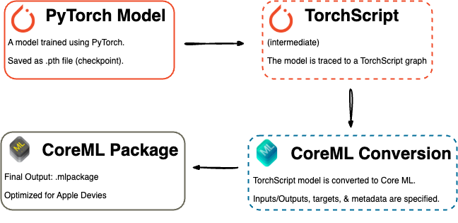

# _ArtEdge_: Real-Time Neural Style Transfer for Mobile Devices

[](https://github.com/g-nitin/ArtEdge)
[](https://opensource.org/licenses/MIT)

This repository contains the source code, models, and supplementary materials for the **ArtEdge** project, as detailed in our report: [_ArtEdge: Real-Time Neural Style Transfer for Mobile Devices_](misc/ArtEdge.pdf).

ArtEdge is a mobile-first iOS application demonstrating the feasibility of performing Neural Style Transfer (NST) directly on-device using edge computing principles. By eliminating the need for cloud processing, ArtEdge achieves low latency inference suitable for real-time applications while enhancing user privacy by keeping images local to the device.

## Key Features

- **On-Device NST:** Performs style transfer directly on iOS devices, leveraging edge computing.
- **Real-Time Performance:** Achieves near real-time inference speeds (millisecond-level for some models) using hardware acceleration.
- **Privacy-Preserving:** User images are processed locally and do not leave the device.
- **Multiple Model Support:** Implements and evaluates four diverse NST architectures:
  - Custom MobileNet AdaIN
  - Fast Style Transfer
  - StyTr² (Transformer-based)
  - AesFA (Mobile-optimized)
- **Core ML Acceleration:** Utilizes Apple's Core ML framework to leverage the Neural Engine for efficient computation.

## Motivation

Neural Style Transfer enables compelling artistic image transformations. However, deploying these models for real-time use on mobile devices faces significant hurdles:

1.  **Latency:** Cloud-based solutions introduce network delay.
2.  **Privacy:** Uploading personal images to servers raises privacy concerns.
3.  **Computational Cost:** NST models can be resource-intensive for mobile hardware.

ArtEdge addresses these challenges by optimizing and deploying NST models directly on the edge (the mobile device), demonstrating a practical path towards accessible and responsive mobile creative tools.

## Architecture & Workflow

ArtEdge follows a mobile-first development philosophy. Models are initially developed or adapted using PyTorch (see `/models` directory) and then converted to Apple's Core ML format (`.mlpackage`) for efficient on-device inference within the iOS app (`/ArtEdge`). This conversion allows the app to utilize the dedicated Neural Engine hardware present in modern iPhones.

**User Interaction Flow:**
The iOS application provides a simple interface for model selection, content/style image input, and stylization, as shown below:

_Figure 1: User workflow in the ArtEdge application. (1) Model Selection, (2) Image Selection, (3) Style Transfer Application._

**Model Conversion Workflow:**

_Figure 2: System workflow showing PyTorch model training/development, conversion to TorchScript, and final conversion to an optimized Core ML package for deployment._

## Models Implemented

ArtEdge integrates four distinct NST models, exploring trade-offs between speed, fidelity, and architectural complexity. The Python source code for development and adaptation of these models can be found in the root `/models` directory. Most of the code follows the original source (below), with some changes to ensure conversion from PyTorch models to Core ML format (with the `convert.py` script). The models are as follows:

1.  **MobileNet AdaIN (Custom)**

    - **Architecture:** Lightweight MobileNetV2 encoder combined with Adaptive Instance Normalization (AdaIN) for arbitrary style transfer.
    - **Adaptations:** Designed from scratch for this project, trained for 20 epochs using perceptual loss (calculated via a separate VGG network during training only). Aims for speed and flexibility. (Python source in `/models/AdaIN/`)
    - **Source:** [MobileNetV2](https://arxiv.org/abs/1801.04381) and [AdaIN](https://arxiv.org/abs/1703.06868) with [PyTorch Implementation](https://github.com/xunhuang1995/AdaIN-style)

2.  **Fast Style Transfer (FST)**

    - **Architecture:** Feed-forward CNN trained for a single specific style using perceptual losses.
    - **Adaptations:** Integrated publicly available pre-trained models. Output clamped to [0, 1] for numerical stability. Represents efficient single-style transfer. (Integration code in `/models/FST/`)
    - **Source:** [Fast Style Transfer](https://arxiv.org/abs/1703.06868) and [PyTorch Implementation](https://github.com/igreat/fast-style-transfer/tree/main)

3.  **StyTr² (Transformer-Based)**

    - **Architecture:** Dual-path transformer using separate encoders for content/style and a decoder, leveraging self-attention and Content-Aware Positional Encoding (CAPE).
    - **Adaptations:** Used official pre-trained model. Codebase adapted to resolve deprecated PyTorch/Torchvision functions for compatibility. Explores attention mechanisms for NST. (Adaptation code in `/models/StyTR-2/`)
    - **Source:** [StyTr²](https://arxiv.org/abs/2208.12327) and [PyTorch Implementation](https://github.com/diyiiyiii/StyTR-2/tree/main)

4.  **AesFA (Mobile-Optimized)**
    - **Architecture:** Lightweight CNN using frequency-domain disentanglement and an aesthetic contrast loss, avoiding heavy VGG backbones at inference.
    - **Adaptations:** Reworked network components and loss calculations for mobile compatibility (Core ML) and performance improvements. Represents state-of-the-art mobile-specific optimization. (Adaptation code in `/models/AesFA/`)
    - **Source:** [AesFA](https://arxiv.org/abs/2209.00277) and [PyTorch Implementation](https://github.com/Sooyyoungg/AesFA)

_(See Table I in the [paper](misc/ArtEdge.pdf) for a summary)_

## Technology Stack

- **Mobile App:** iOS (Swift, Xcode 16.3+)
- **ML Framework (Mobile):** Apple Core ML
- **ML Framework (Development):** PyTorch (2.5)
- **Model Conversion:** Core ML Tools (8.2)
- **Programming Language (Models):** Python 3.9

## Evaluation & Results

Experiments were conducted on a MacBook Air M1 (CPU) and an iPhone 15 Pro (Neural Engine via Core ML).

- **Inference Speed:** On-device inference using Core ML significantly outperformed laptop CPU execution for most models, demonstrating the effectiveness of hardware acceleration. Lightweight models (MobileNet AdaIN, FST) achieved the lowest latency, while complex models (AesFA, StyTr²) showed substantial speedups on mobile compared to the laptop baseline. (See Figure 4 in the paper).
- **Visual Fidelity:** A trade-off exists between speed and quality.
  - `MobileNet AdaIN` / `FST`: Faster, suitable for interactive use, but produce results with less stylistic detail or intensity (partly due to limited training for the custom model).
  - `AesFA` / `StyTr²`: Offer superior style adherence and detail preservation at the cost of higher latency.
  - Minor quality degradation (slight softening) was observed on mobile compared to desktop, likely due to image resizing steps in the Core ML pipeline.

**Qualitative Results Comparison:**

_Figure 5: Comparison of stylized outputs across models on Laptop (yellow background) vs. Mobile (blue background)._

Overall, the results confirm the viability of deploying sophisticated NST models for near real-time performance on modern mobile devices.

## Getting Started

1.  Clone this repository: `git clone https://github.com/g-nitin/ArtEdge.git`
2.  Open the `ArtEdge/ArtEdge.xcodeproj` project in Xcode (version 16.3 or later recommended).
3.  Ensure the Core ML models (`.mlpackage` files) are correctly referenced in the Xcode project. They might be included directly or need to be downloaded/placed.
4.  Build and run the application on a physical iOS device (iPhone recommended for Neural Engine performance) running iOS 18 or later.

## Repository Structure

```
.
├── ArtEdge/            # Source code for the ArtEdge iOS Application (Swift, Xcode Project)
│   ├── ArtEdgeApp.swift
│   ├── Assets.xcassets/  # Image assets, app icons, banner
│   ├── CameraPreviewView.swift
│   ├── CameraService.swift
│   ├── ContentView.swift
│   ├── ImagePicker.swift
│   ├── models/           # Contains the compiled Core ML models (.mlpackage) used by the app
│   ├── StyleInfo.swift
│   └── StyleTransferService.swift
├── ArtEdge.xcodeproj   # Xcode project file
├── LICENSE             # Project License (MIT)
├── misc/               # Miscellaneous supplementary materials
│   ├── ArtEdge.pdf       # Link to the research paper PDF (if included)
│   └── images/           # Images used in the paper/README (Figs 1, 2, 5, Banner)
├── models/             # Python source code for model development, adaptation, and training
│   ├── AdaIN/            # Custom MobileNet AdaIN implementation (PyTorch)
│   ├── AesFA/            # AesFA adaptation code (PyTorch)
│   ├── FST/              # Fast Style Transfer integration code (PyTorch)
│   ├── StyTR-2/          # StyTR-2 adaptation code (PyTorch)
│   ├── pyproject.toml    # Python project dependencies (for uv/pip)
│   └── uv.lock           # Locked Python dependencies
└── README.md           # This file
```

## License

This project is licensed under the MIT License - see the `LICENSE` file for details.

## Contact

- Nitin Gupta - `niting@email.sc.edu`
- Nayeem Mohammad - `nayeem@email.sc.edu`

Department of Computer Science and Engineering, University of South Carolina.
